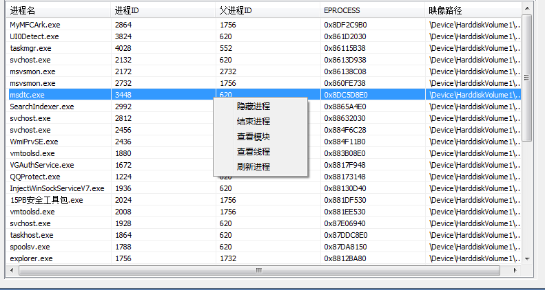
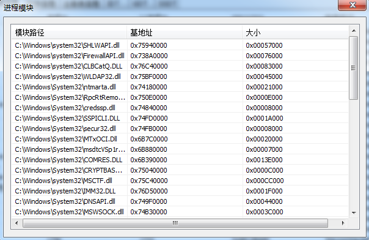
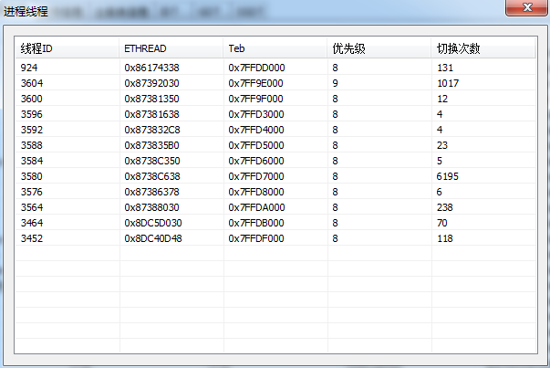
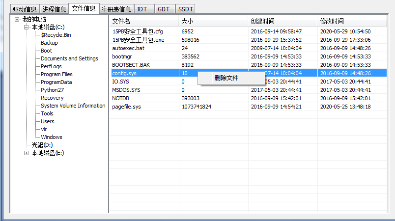
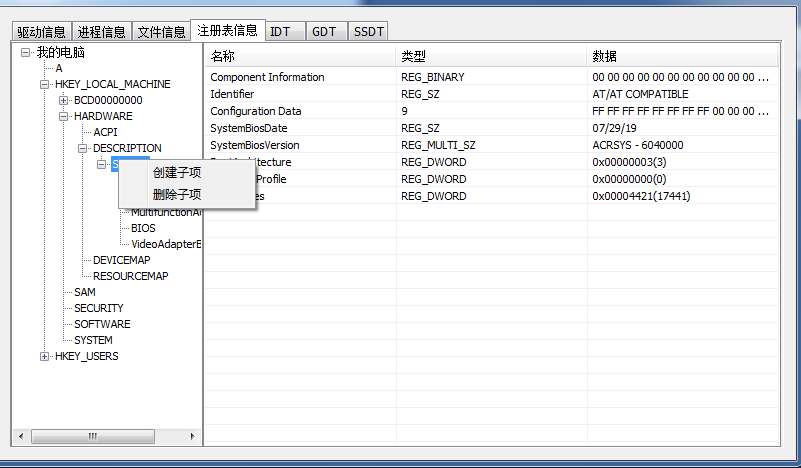
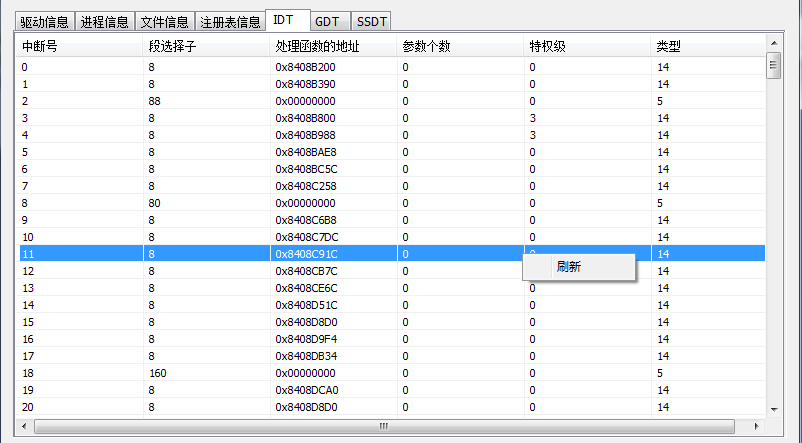
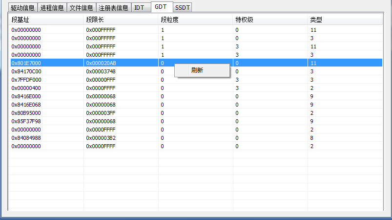
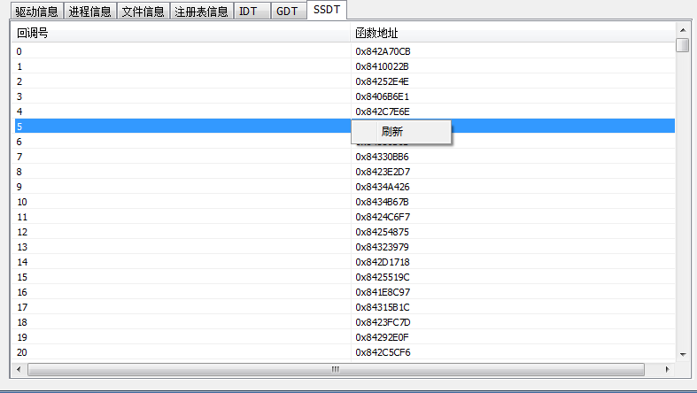

# README

## 前言

仿PCHunter32做的一个简易ARK，练手之作，以此记录。如有错误，不吝赐教。

## 界面

## 功能介绍

### 驱动信息

#### 遍历/刷新驱动

在内核层通过驱动链(只使用了按加载顺序构成的链表，还可以使用按内存顺序构成或按初始化顺序构成的链表)遍历所有驱动的信息

#### 隐藏驱动

通过对比驱动名，将要隐藏的驱动从驱动链(按加载顺序构成的链表)上摘除。原本它邻接的节点驱动被卸载时，系统会把此节点的Flink,Blink域指向它相邻节点的下一个节点，但是，它此时已经脱离链表了，如果现在它原本相邻的节点驱动，被卸载了，那么此节点的Flink,Blink域将有可能指向无用的地址而造成随机性的BSoD。为了防止随机性的BSOD(蓝屏死机)，将要隐藏的驱动LIST_ENTRY结构体的Flink,Blink域指向自己

### 进程信息

#### 遍历/刷新进程

在内核层通过EPROCESS进程执行体块获取进程活动链表，遍历进程活动链表获取所有EPROCESS进程执行体块，从而获取所有进程的信息

#### 隐藏进程

同隐藏驱动差不多，将要隐藏的进程在进程活动链表摘除，就不多说了

#### 结束进程

将要结束的进程的ID传输到内核层，使用ZwOpenProcess打开进程，获取进程句柄，然后使用ZwTerminateProcess结束进程

#### 查看模块

弹出一个对话框，并遍历选中进程的所有模块信息。通过进程执行体块EPROCESS找到PEB，再使用进程挂靠附加到目标进程中，通过PEB获取模块链表，遍历模块链表获取所有模块信息

#### 查看线程

弹出一个对话框，并遍历选中进程的所有线程信息。通过进程执行体块EPROCESS获取进程的线程链表，通过遍历线程链表获取所有的线程执行体块ETHREAD，从而获取该进程的所有线程信息

### 文件信息

#### 遍历文件

通过ZwQueryDirectoryFile函数实现内核版FindFirstFile、FindNextFile函数,然后同用户层遍历文件一样使用这两个内核版函数遍历文件

**注意：内核中操作文件需要在文件名加前缀 `\\??\\`**

#### 删除文件

使用 ZwDeleteFile 删除文件

### 注册表信息

#### 遍历注册表

通过ZwOpenKey打开注册表键(根键为`\\Registry`),获取注册表键句柄

通过ZwQueryKey获取一个注册表项有多少子项和子键

通过ZwEnumerateKey获取指定子项的信息

通过ZwEnumerateValueKey获取指定子键的信息

最后通过ZwClose关闭注册表键句柄

#### 创建子项

使用InitializeObjectAttributes宏初始化对象属性，它主要初始化注册表键径

然后通过ZwCreateKey创建

#### 删除子项

使用InitializeObjectAttributes宏初始化对象属性，它主要初始化注册表键径

然后通过ZwOpenKey打开注册表键，获取注册表句柄

使用ZwDeleteKey删除注册表键

最后通过ZwClose关闭注册表键句柄

### IDT(中断描述符表)

#### 遍历/刷新IDT

IDT表存放于IDTR寄存器，可以使用汇编指令 `__asm sidt sidtInfo;`来获取IDTR寄存器的值，从而获取IDT表的首地址

### GDT(全局描述符表)

#### 遍历/刷新GDT

GDT表存放于GDTR寄存器，可以使用汇编指令 `__asm sgdt sgdtInfo;`来获取GDT表首地址和GDT表项数

### SSDT(系统符号调度表)

#### 遍历/刷新SSDT

WIN7 - x32下系统导出系统描述符表 KeServiceDescriptorTable 变量。声明后，就可以直接使用。通过这个变量可以获取到SSDT的首地址，参数个数表的首地址、服务函数的个数以及SSDT中每个服务被调用的次数

### SYSENTER-HOOK

通过修改SYSENTER_EIP_MSR(编号0x176)寄存器使其指向我们自己的函数，就可以在自己的函数中对所有来自Ring3层的调用进行第一手过滤。

过程：

- ​	读取SYSTENTER_EIP_MSR寄存器的信息，并备份系统KiFastCallEntry函数的地址
- 构建一个我们自己的MyKiFastCallEntry函数用以过滤调用信息
- 设置SYSTENTER_EIP_MSR寄存器指向我们自己构造的函数的地址
- 如果需要摘除钩子，将备份的系统KiFastCallEntry函数地址写回SYSTENTER_EIP_MSR寄存器即可

### 内核重载

- 将内核文件加载到内存
- 修复重定位
- 使用当前内核数据填充新内核的SSDT表
-  HOOK KiFastCallEntry,使RING3进程调用走新内核

## 说明：

1. ​	本程序仅用于交流和研究，请勿用于其他用途。有任何后果与本人无关
2. ​	由于环境不一样 所以不能保证每个功能在每台机器上都是可行的。如果程序有bug还请多多体谅